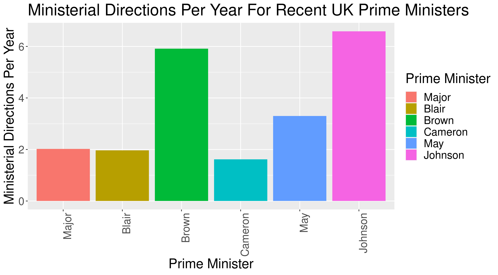

# ministerial_directions

Some data and an analysis showing that the number of ministerial directions in the UK is going up. This only shows up if you normalise the number of such directions by the time in office of the prime minister.

The graph looks like this 

